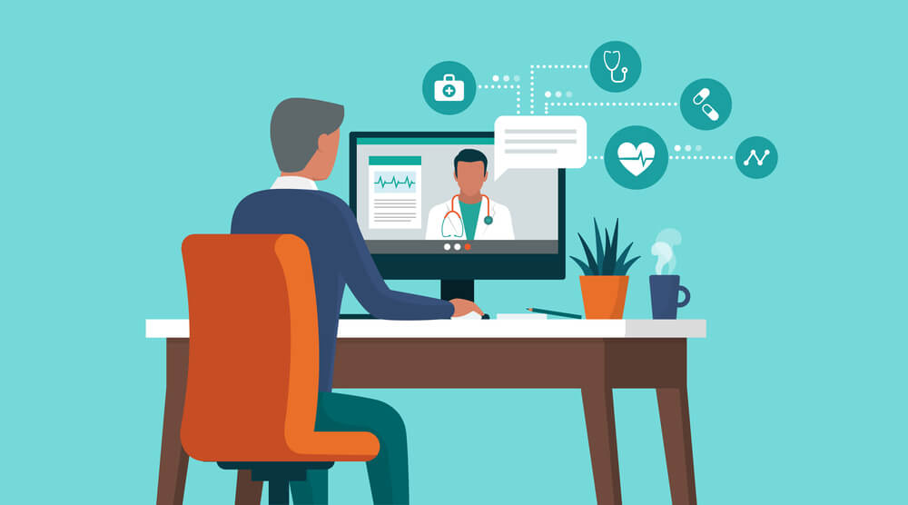
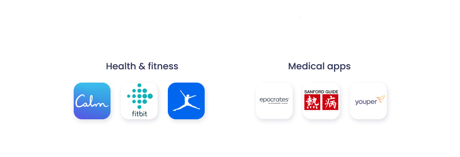
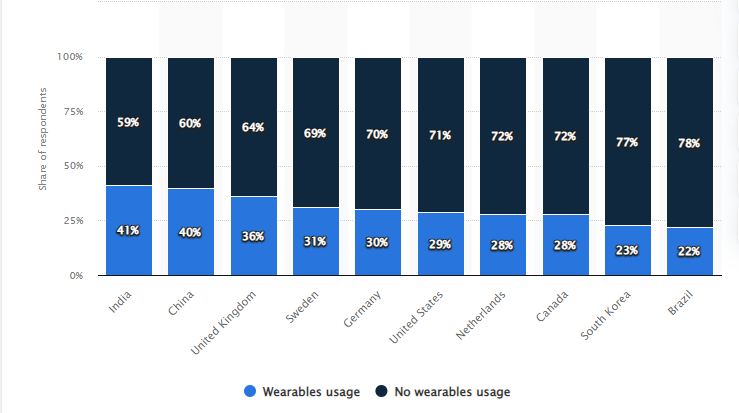

# mHealth
---
### What is mHeath?
> “We believe consumer health technologies — apps, wearables, self-diagnosis tools — have the potential to strengthen the patient-physician connection and improve health outcomes.”  
> ***~Dr. Glen Stream, Chairman, Family Medicine for America’s Health***

  
*mHealth in action*  
Robert Istepanian introduced the term “mHealth” to refer to the use of "developing mobile communications and network technologies for healthcare." Mobile health (mHealth) refers to the use of mobile phones and other wireless technologies in medical care. mHealth, or mobile health, is a fast expanding discipline that employs mobile technology to enhance healthcare outcomes. mHealth encompasses numerous uses, such as telemedicine, remote patient monitoring, and health education. The rising availability of smartphones and other mobile devices, coupled with developments in wireless technology, has enabled healthcare providers to give patients with in novel and inventive ways. 
 
### mHealth Tools and Technologies

mHealth technologies and tools refer to the use of mobile devices and digital technology to assist and enhance health and healthcare. This includes telemedicine, mobile health apps, wearable gadgets, and remote monitoring systems. These tools and technologies offer numerous benefits in healthcare, including enhanced access to information and services, more patient engagement, and improved disease management and prevention.

<iframe width="560" height="315" src="https://www.youtube.com/embed/ItNZILObXhA" title="YouTube video player" frameborder="0" allow="accelerometer; autoplay; clipboard-write; encrypted-media; gyroscope; picture-in-picture; web-share" allowfullscreen></iframe> 
 
**1. Telemedicine:**
Telemedicine is the electronic transmission of medical information from one location to another, which improves patient health condition. Telemedicine has numerous uses and can be utilized for a variety of services, such as wireless tools, email, two-way video, cellphones, and other forms of telecommunications technology. 

  
*Illustration of Telemedicine*  
**2.	Mobile health (mHealth) apps:**
The prevalence of mHealth and telehealth applications for consumers and healthcare providers continues to rise.
 
*Google Play Store’s most popular health software*  
Recent research indicates that Google Play hosts approximately 47 thousand healthcare applications of various types. This number is going up by 1.5% every three months, which shows how much more people are interested in mobile health. 

<iframe width="560" height="315" src="https://www.youtube.com/embed/OZT0TocN-hE" title="YouTube video player" frameborder="0" allow="accelerometer; autoplay; clipboard-write; encrypted-media; gyroscope; picture-in-picture; web-share" allowfullscreen></iframe> 
 
**3. Wearable devices:**
Wearables have significant potential for health research and data collection. They can collect data for a more accurate clinical diagnosis and enable remote patient monitoring. They have found substantial uses in the following disciplines in recent years:

 •	COVID-19 forecasts 
•	Fertility monitoring 
•	Heat-related disorders 
•	Drug effects 
•	Behavioral interventions 

 
*Wearable devices usage in various countries in 2022*  

Thus, wearable healthcare technology has several benefits for the individual and the public. As this technology gains popularity, manufacturers are racing to create wearables for specific health conditions. Wearables are already part of daily life, and some have wide commercial applications.
